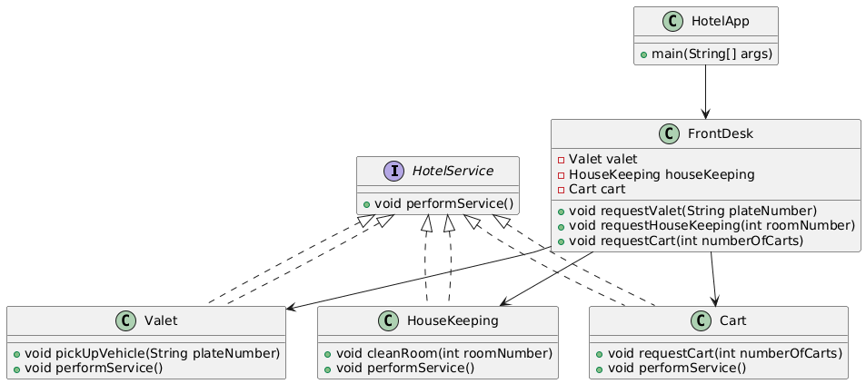

# Simplified Hotel Management System

## UML Diagram

## Overview

The `HotelApp` needs to manage various hotel services for guest check-in and check-out. These services include:

- Valet parking for vehicles
- Room cleaning
- Handling luggage carts

The `HotelApp` interacts with these services through a simplified, single interface provided by the `FrontDesk`. The `FrontDesk` class delegates the client's requests to the appropriate service classes (`Valet`, `HouseKeeping`, `Cart`), abstracting the service details from the client.

## Class Definitions

- **HotelService (Interface):** Defines the common interface for all hotel services.

- **Valet:**
	- Implements the `HotelService` interface
	- Responsible for vehicle valet parking and pick-up
	- Method: `pickUpVehicle(plateNumber)`

- **HouseKeeping:**
	- Implements the `HotelService` interface
	- Responsible for room cleaning
	- Method: `cleanRoom(roomNumber)`

- **Cart:**
	- Implements the `HotelService` interface
	- Responsible for handling luggage cart requests
	- Method: `requestCart(numberOfCarts)`

- **FrontDesk:**
	- The facade class that coordinates interactions between the client (`HotelApp`) and the individual hotel services

- **HotelApp:**
	- The client class that uses the `FrontDesk` facade to access and utilize hotel services seamlessly